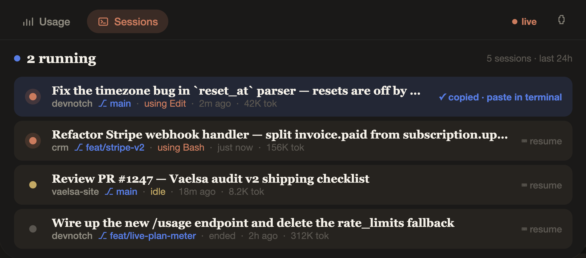

# DevNotch

> Resume any Claude Code conversation with one click. Live Claude usage in your Mac's notch.

Built for developers who live in Claude Code and lose track of which session had the context they need.

**One-click session resume.** Your Sessions tab lists every Claude Code conversation
from today — with the **first thing you typed** as the title so you remember what
it was. Click any row and your clipboard gets `cd <cwd> && claude --resume <id>`.
Paste it in any terminal and you're back with full context, in the right working
directory, on the right git branch.

**Live plan meter.** Hover the notch → see the real numbers from your claude.ai
account: 5-hour session %, weekly %, Sonnet-only, extra credits. Same data as the
web dashboard, no context-switch needed.

Minimal. Local. Open source. Not affiliated with Anthropic.

## Install

> ⚠️ Requires macOS 14 (Sonoma) or later, and a Mac with a notch.

**From source (unsigned, fastest):**

```bash
curl -fsSL https://raw.githubusercontent.com/AlejandroVallejo1/devnotch/main/Scripts/install-from-source.sh | bash
```

The installer uses Xcode command-line tools + Homebrew's `xcodegen` to build
the app locally and drop it into `/Applications`. First launch, macOS will ask
you to allow it (unsigned app) — right-click → Open.

**Manual build:**

```bash
git clone https://github.com/AlejandroVallejo1/devnotch.git
cd devnotch
brew install xcodegen
xcodegen
open DevNotch.xcodeproj   # then ⌘R in Xcode
```

## The feature nobody else has: one-click resume

Claude Code tells you *how* to resume a session — you just never want to go
copy-paste from the log file. DevNotch makes it a click:

1. Click the Sessions tab
2. Find the conversation — it's titled by **what you actually asked**
   ("Fix the auth bug in `login.swift`"), not by session ID
3. Click the row → clipboard gets `cd <cwd> && claude --resume <id>`
4. Paste in terminal → you're back where you left off

Each row shows: **project · git branch · state (thinking / running Bash / idle) ·
time since last activity · tokens spent**. At a glance you know which conversation
was which.

## Live claude.ai plan meter



**Connect your claude.ai account once** (Menu bar 📊 → Connect to claude.ai…)
and the notch shows the same real numbers your claude.ai dashboard shows:

- **Current session** (5h rolling window) with reset countdown
- **Weekly** usage across all models
- **Sonnet-only** weekly quota
- **Extra credits** (pay-as-you-go) with dollar amount spent

When you're not connected, DevNotch falls back to parsing your local
`~/.claude/projects/` logs and estimating usage from pricing-weighted tokens.

## Notifications

Native system notification when you hit a configurable threshold (default 80%)
of your session or weekly quota.

## How your data is used

Short version: **only by you, only locally.** Full details in
[`PRIVACY.md`](PRIVACY.md).

- `~/.claude/projects/` is read on your Mac and never leaves it.
- If you connect claude.ai, your session cookie is saved in the macOS **Keychain**
  and used *only* to call `https://claude.ai/api/organizations/{your-org}/usage`
  directly from your Mac.
- No server. No analytics. No telemetry. No crash reporter. No tracking.

You can verify all of this by reading `Features/Auth/` and `Features/Usage/` —
it's ~400 lines of Swift.

## FAQ

**Does this talk to any server I don't control?**  
No. The only network destination is `https://claude.ai/`, using *your* cookie,
and only when you explicitly sign in.

**What if Anthropic changes the endpoint?**  
Live data stops. The app degrades gracefully to local estimates from Claude Code
logs until the next update.

**Does it work without Claude Code?**  
The live-meter feature only needs a claude.ai account. The session-resume feature
obviously needs Claude Code, because that's where the sessions come from.

**Why weighted tokens in the fallback?**  
Raw tokens are dominated by cache reads (which are billed at 10% of input).
Weighted tokens use Anthropic's API pricing ratios
(`input×1 + output×5 + cacheCreate×1.25 + cacheRead×0.1`) so the fallback
bar roughly tracks the real plan meter.

**Is this legal?**  
See [`DISCLAIMER.md`](DISCLAIMER.md). Short: unofficial, uses your own
authenticated session. Anthropic could change the endpoint at any time.

## Contributing

Issues and PRs welcome. If Anthropic rotates the usage endpoint, the fix is
usually a one-line change in `ClaudeNotch/Features/Auth/ClaudeWebAPI.swift`.

## Support

If DevNotch saves you time, a ⭐ on GitHub or a
[coffee](https://buymeacoffee.com/alejandrovallejo) keeps updates shipping.

## License

MIT — see [`LICENSE`](LICENSE).

## Legal

- [`DISCLAIMER.md`](DISCLAIMER.md) — trademark use, ToS considerations, warranty.
- [`PRIVACY.md`](PRIVACY.md) — exact data handling.
- [`SECURITY.md`](SECURITY.md) — responsible disclosure.

"Claude" and "Anthropic" are trademarks of Anthropic PBC, used nominatively.
DevNotch is not affiliated with, endorsed by, or approved by Anthropic.
