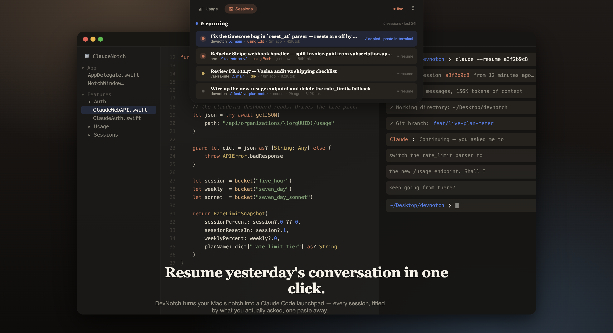

# ClaudeNotch

> Your Mac's notch, as a live Claude usage dashboard.

Hover over your notch. See your real **claude.ai** plan meter — the same 5-hour
session %, weekly %, Sonnet-only quota, and pay-as-you-go credits that the web
app shows. See every Claude Code session from today with a one-click
`claude --resume` ready to paste in your terminal.

Minimal. Local. Open source. Not affiliated with Anthropic.



## Install

> ⚠️ Requires macOS 14 (Sonoma) or later, and a Mac with a notch.

**From source (unsigned, fastest):**

```bash
curl -fsSL https://raw.githubusercontent.com/AlejandroVallejo1/claudenotch/main/Scripts/install-from-source.sh | bash
```

The installer uses Xcode command-line tools + Homebrew's `xcodegen` to build
the app locally and drop it into `/Applications`. First launch macOS will ask
you to allow it (unsigned app) — right-click → Open.

**Manual build:**

```bash
git clone https://github.com/AlejandroVallejo1/claudenotch.git
cd claudenotch
brew install xcodegen
xcodegen
open ClaudeNotch.xcodeproj   # then ⌘R in Xcode
```

## What you get

### Live plan meter
Connect your claude.ai account once (**Menu bar 📊 → Connect to claude.ai…**)
and the notch shows the real numbers from your account:

- **Current session** (5h rolling window) with reset countdown
- **Weekly** usage across all models
- **Sonnet-only** weekly quota
- **Extra credits** (pay-as-you-go) with dollar amount spent

When you're not connected, the app falls back to parsing your local
`~/.claude/projects/` logs and estimating usage from pricing-weighted tokens.

### Developer-aware sessions
The Sessions tab lists every Claude Code session you ran today:

- Top line: the **first message you typed** — so you know which conversation
  was which
- Bottom meta: **project**, **git branch**, current **state**
  (thinking / running tool / idle), time since last activity, tokens spent
- Click any row → clipboard gets `cd <cwd> && claude --resume <id>`.
  Paste it in any terminal to resume that exact conversation, with full context.

### Notifications
Native system notification when you hit 80% of your session or weekly quota
(configurable in Preferences).

## How your data is used

Short version: **only by you, only locally.** Longer version in
[`PRIVACY.md`](PRIVACY.md).

- `~/.claude/projects/` is read on your Mac and never leaves it.
- If you connect claude.ai, your session cookie is saved in the macOS **Keychain**
  and used *only* to call `https://claude.ai/api/organizations/{your-org}/usage`
  directly from your Mac.
- No server. No analytics. No telemetry. No crash reporter. No tracking.

You can verify all of this by reading `Features/Auth/` and `Features/Usage/` —
it's ~400 lines of Swift.

## Frequently asked

**Does this talk to any server I don't control?**  
No. The only network destination is `https://claude.ai/`, using *your* cookie,
and only when you explicitly sign in.

**What happens if Anthropic changes the endpoint?**  
Live data stops. The app degrades gracefully to local estimates from Claude Code
logs until we ship an update.

**Does it work without Claude Code?**  
Yes — the live-meter feature only needs a claude.ai account. Sessions tab needs
Claude Code because that's where sessions live.

**Why weighted tokens in the fallback?**  
Raw tokens are dominated by cache reads (which are billed at 10% of input).
Weighted tokens use Anthropic's API pricing ratios
(`input×1 + output×5 + cacheCreate×1.25 + cacheRead×0.1`) so the fallback
bar roughly tracks the real plan meter.

**Is this legal?**  
See [`DISCLAIMER.md`](DISCLAIMER.md). Short: unofficial, uses your own
authenticated session. Anthropic could change the endpoints at any time.

## Contributing

Issues and PRs welcome. If Anthropic changes the usage endpoint and live
breaks, the fix is usually a one-line change in
`ClaudeNotch/Features/Auth/ClaudeWebAPI.swift`.

## Support

If this saves you time, consider a ⭐ on GitHub or a [coffee](https://buymeacoffee.com/alejandrovallejo).

## License

MIT — see [`LICENSE`](LICENSE).

## Legal

- [`DISCLAIMER.md`](DISCLAIMER.md) — trademark use, ToS considerations, warranty.
- [`PRIVACY.md`](PRIVACY.md) — exact data handling.
- [`SECURITY.md`](SECURITY.md) — responsible disclosure.

"Claude" and "Anthropic" are trademarks of Anthropic PBC, used nominatively.
ClaudeNotch is not affiliated with, endorsed by, or approved by Anthropic.
